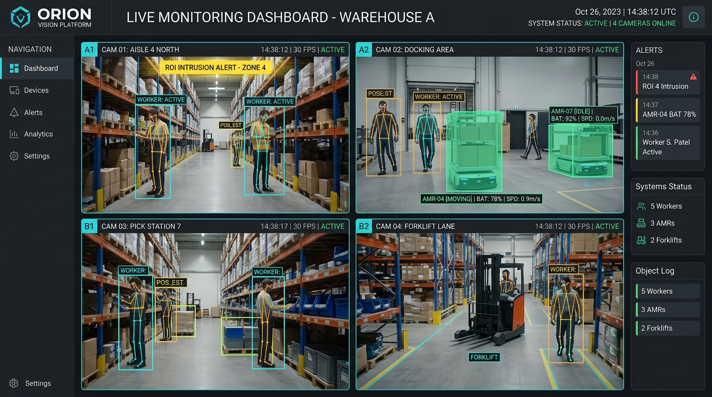
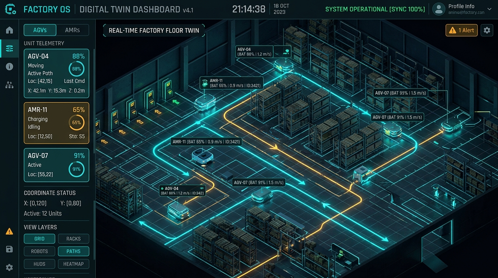
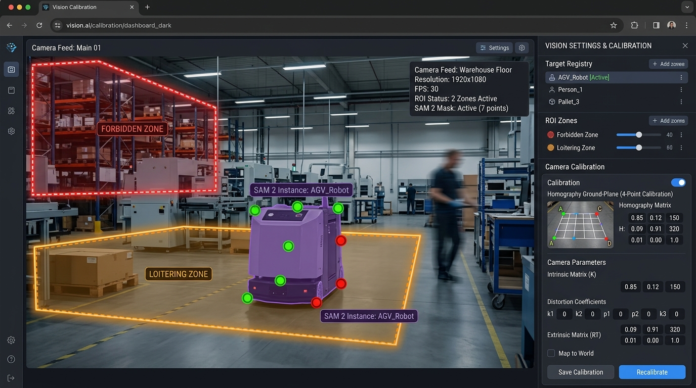
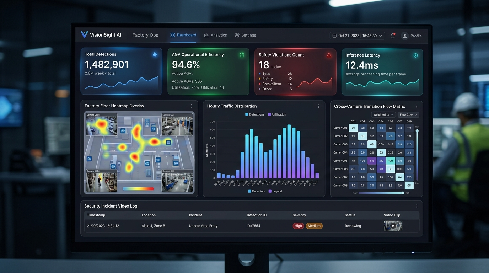

# 👁️🤖 RTC Vision & Robot Management System (VMS + FMS Digital Twin 3D)

> **Hệ thống giám sát thị giác máy tính AI (VMS) kết hợp Bản đồ số 3D Digital Twin điều hành đội xe AGV/AMR (FMS)**  
> Tích hợp thời gian thực NVIDIA DeepStream, YOLOv8x-Pose, Segment Anything 2 (SAM 2), Three.js 3D Digital Twin, WebRTC WHEP và MQTT VDA-5050.

---

## 📑 Mục lục
- [1. Kiến trúc hệ thống tổng quan](#-1-kiến-trúc-hệ-thống-tổng-quan)
- [2. Chi tiết các module giao diện](#-2-chi-tiết-các-module-giao-diện)
  - [2.1. Monitor View (Giám sát Multi-Camera AI)](#21-monitor-view---giám-sát-multi-camera-ai-live)
  - [2.2. Map Robot 3D (Digital Twin FMS)](#22-map-robot-3d---digital-twin-fms-threejs)
  - [2.3. Building & Target Registration (Cấu hình ROI & SAM2 Mask)](#23-building--target-registration---cấu-hình-roi--sam2-mask)
  - [2.4. Analytics & Historical Audit (Thống kê & Báo cáo)](#24-analytics--historical-audit---thống-kê--báo-cáo)
- [3. Công nghệ AI & Thị giác máy tính](#-3-công-nghệ-ai--thị-giác-máy-tính)
- [4. Hướng dẫn cài đặt & Khởi động nhanh](#-4-hướng-dẫn-cài-đặt--khởi-động-nhanh)
- [5. Danh mục cổng dịch vụ (Ports)](#-5-danh-mục-cổng-dịch-vụ-ports)
- [6. Lệnh quản trị hữu ích](#-6-lệnh-quản-trị-hữu-ích)

---

## 🏗️ 1. Kiến trúc hệ thống tổng quan

```
                                      ┌──────────────────────────────────────────────┐
                                      │              FMS Server (LAN)                │
                                      │   192.168.5.105:1883 (MQTT Broker VDA 5050)  │
                                      │   192.168.5.105:5432 (PostgreSQL fms_db_v2)  │
                                      └──────────────────────┬───────────────────────┘
                                                             │
                                                       MQTT & DB Sync (10Hz)
                                                             │
                                                             ▼
┌─────────────────────────────────┐               ┌───────────────────────────────────────────┐
│     IP Cameras (RTSP Streams)   │──────────────▶│       FastAPI Core Backend (Port 8000)    │
│  - 192.168.5.201, 241, 242, 243 │               │ - DeepStream 8.0 / TensorRT YOLOv8x-Pose  │
└─────────────────────────────────┘               │ - SAM 2 Realtime Mask Engine              │
                                                  │ - Cross-Camera ReID & Homography Calib    │
┌─────────────────────────────────┐               │ - Fusion Bridge: Vision AI ⟷ FMS Odom     │
│   MediaMTX WebRTC (Port 8081)   │◀──────────────│ - WebSocket Server (/ws, /ws/fms)         │
│     - Ultra Low-latency WHEP    │               │ - ChromaDB Vector Store & RAG AI Chatbot  │
└─────────────────────────────────┘               └─────────────────────┬─────────────────────┘
                                                                        │
                                                              WebSocket & REST APIs
                                                                        │
                                                                        ▼
                                                  ┌───────────────────────────────────────────┐
                                                  │    Next.js Web Dashboard (Port 3000)      │
                                                  │ ├── 🖥️ 1. Monitor (Live AI Grid)          │
                                                  │ ├── 🗺️ 2. Map Robot 3D (Three.js Twin)    │
                                                  │ ├── 📐 3. Building (ROI, Homography, SAM2)│
                                                  │ └── 📊 4. Analytics (BI, Heatmap & Logs)  │
                                                  └───────────────────────────────────────────┘
```

---

## 🖥️ 2. Chi tiết các module giao diện

### 2.1. Monitor View - Giám sát Multi-Camera AI Live

Giao diện trung tâm giám sát thời gian thực toàn bộ mạng lưới camera với độ trễ cực thấp (<200ms qua WebRTC WHEP), tích hợp toàn bộ các lớp trực quan hóa AI:



* **YOLOv8x-Pose Skeleton Overlay**: Nhận diện 17 điểm khớp xương người theo thời gian thực, phát hiện dáng điệu (`Standing`, `Sitting`, `Lying Down / Fall Alert`).
* **SAM 2 Instance Mask**: Hiển thị lớp phủ màu bán trong suốt bám sát đường biên thực của robot/kệ hàng đã đăng ký.
* **Định vị mặt sàn (Homography Floor Mapping)**: Chuyển đổi tọa độ pixel chân đối tượng sang tọa độ mặt sàn thế giới thực $(X, Y)$ mét.
* **Fusion Cross-Check Badge**: Đối chiếu chéo vị trí nhận diện từ Camera với tọa độ Odometry từ FMS Server (`SYNCED`, `DEVIATED`, `FMS_ONLY`, `VISION_ONLY`).
* **Đăng ký vật thể trực tiếp**: Cho phép nhấp chọn trực tiếp đối tượng trên khung hình để tạo mask và lưu vào bộ nhớ nhận dạng.

---

### 2.2. Map Robot 3D - Digital Twin FMS (Three.js)

Bản đồ số 3D tái hiện toàn diện không gian nhà xưởng, vị trí đội xe AGV/AMR, con người và hàng hóa:



* **Công nghệ 3D Three.js & OrbitControls**: Cho phép xoay, zoom, pan tự do hoặc khóa camera theo dõi sát đuôi robot (`Camera Follow Mode`).
* **Nội suy chuyển động 60 FPS LERP**: Tự động mượt mà hóa quỹ đạo di chuyển giữa các gói tin Telemetry 10Hz từ FMS Server.
* **Laser SLAM 2D/3D Hybrid Overlay**: Hiển thị ảnh quét laser SLAM thực tế (`fms_map.png`) kết hợp các mô hình khối 3D (kệ hàng, trạm sạc, tường ngăn, cột mốc).
* **Tích hợp vị trí con người từ Vision AI**: Chiếu tọa độ 3D của công nhân từ hệ thống camera trực tiếp lên sàn 3D, giúp cảnh báo va chạm giữa người và robot.
* **Tự động chuyển đổi Chế độ mô phỏng (Simulation Fallback)**: Nếu mất kết nối với FMS LAN, hệ thống tự động chạy engine giả lập chuyển động để duy trì demo/thử nghiệm.

---

### 2.3. Building & Target Registration - Cấu hình ROI & SAM2 Mask

Không gian thiết lập các vùng an ninh, hiệu chuẩn ma trận Homography và đăng ký học mẫu vật thể:



* **Vẽ vùng an ninh đa giác (Polygon ROI)**: Thiết lập không giới hạn vùng cấm, vùng cảnh báo an toàn cho xe nâng / AGV.
* **Zero-Shot SAM 2 Interactive Prompter**: Dùng nhấp chuột trái (`+ Điểm vật`) và nhấp chuột phải (`- Điểm nền`) để lấy đường biên hoàn hảo cho bất kỳ vật thể nào không cần train lại model.
* **Lưu đa góc nhìn (Multi-View Angle Memory)**: Lưu trữ các góc nhìn khác nhau của cùng một đối tượng để tăng độ chính xác khi tracking dưới nhiều điều kiện ánh sáng.

---

### 2.4. Analytics & Historical Audit - Thống kê & Báo cáo

Trung tâm phân tích dữ liệu thị giác máy tính và hiệu suất vận hành:



* **Biểu đồ động tương tác (Recharts)**: Thống kê mật độ lưu lượng theo giờ, biểu đồ phân bố trạng thái di chuyển của đội xe FMS.
* **Ma trận chuyển vùng liên Camera (Cross-Camera Transitions)**: Theo dõi hành trình di chuyển của đối tượng qua nhiều góc camera trong tòa nhà.
* **Kho lưu trữ sự cố kèm Video Playback**: Tự động cắt và lưu video ngắn 15s-30s khi có sự cố cảnh báo (ROI violation / Fall detection) để tra soát lại.

---

## 🧠 3. Công nghệ AI & Thị giác máy tính

| Thành phần AI | Công nghệ / Framework | Vai trò & Tính năng |
| :--- | :--- | :--- |
| **DeepStream Engine** | NVIDIA DeepStream 8.0 + TensorRT | Xử lý song song nhiều luồng RTSP camera ở mức phần cứng GPU, tối ưu hóa NVDEC & NVEGL. |
| **Human Pose & Detection** | YOLOv8x-Pose TensorRT Engine | Phát hiện con người & bóc tách 17 khớp xương (mũi, mắt, tai, vai, khuỷu, cổ tay, hông, gối, cổ chân) để phân tích hành vi ngã/ngồi/đứng. |
| **Instance Segmentation** | Segment Anything 2 (SAM 2) | Bám vết và vẽ mask chính xác theo thời gian thực cho robot AGV và kệ hàng đã đăng ký. |
| **Shared Feature Backbone** | SAM2 Image Feature Caching | Trích xuất đặc trưng ảnh một lần cho nhiều nhãn trên cùng camera, giảm 60% tải suy luận GPU. |
| **Re-Identification (ReID)** | OSNet / ResNet50 ReID Embeddings | Định danh người đồng nhất giữa các camera khác nhau (Global ID Tracking). |
| **Vector Search Engine** | ChromaDB / Cosine Similarity | Lưu trữ và đối sánh vector đặc trưng khuôn mặt / dáng người / nhãn vật thể với tốc độ mili-giây. |
| **RAG Assistant** | LLM + Semantic Vector Index | Trợ lý AI tích hợp sẵn, giải đáp thắc mắc về sự cố, vị trí robot và nhật ký hệ thống bằng ngôn ngữ tự nhiên. |

---

## 🚀 4. Hướng dẫn cài đặt & Khởi động nhanh

### Yêu cầu phần cứng & môi trường:
* **GPU**: NVIDIA RTX (khuyên dùng RTX 3060 / 4060 Ti / 5060 Ti trở lên, VRAM $\ge$ 8GB).
* **Hệ điều hành**: Ubuntu 22.04 LTS / 24.04 LTS.
* **Phần mềm**: Docker & NVIDIA Container Toolkit, Node.js 18+, Python 3.10+.

### Khởi động toàn bộ hệ thống bằng 1 lệnh:
```bash
cd "/home/rtcai/Desktop/Vision Manager"
./run_all.sh
```

---

## 🔌 5. Danh mục cổng dịch vụ (Ports)

| Dịch vụ | Địa chỉ URL / Port | Mô tả |
| :--- | :--- | :--- |
| 🌐 **Next.js Web Dashboard** | [http://localhost:3000](http://localhost:3000) | Giao diện điều hành chính (Monitor, 3D Map, Building, Analytics) |
| 🔌 **FastAPI Backend REST** | [http://localhost:8000/docs](http://localhost:8000/docs) | Swagger API documentation & Core controller |
| 🤖 **FMS Telemetry WebSocket** | `ws://localhost:8000/ws` | Kênh WebSocket truyền dữ liệu robot & bounding box thời gian thực |
| 📹 **MediaMTX WebRTC Streamer** | [http://localhost:8081](http://localhost:8081) | Máy chủ phân phối luồng WHEP WebRTC siêu độ trễ thấp |
| 🗄️ **PostgreSQL FMS DB** | `localhost:5432` | Cơ sở dữ liệu lưu trữ lịch sử sự kiện & layout bản đồ |

---

## 🛠️ 6. Lệnh quản trị hữu ích

* **Xem nhật ký hoạt động trực tiếp (Logs)**:
  ```bash
  ./run_all.sh logs
  ```
* **Kiểm tra trạng thái các container**:
  ```bash
  ./run_all.sh status
  ```
* **Dừng an toàn toàn bộ hệ thống**:
  ```bash
  ./run_all.sh stop
  ```
