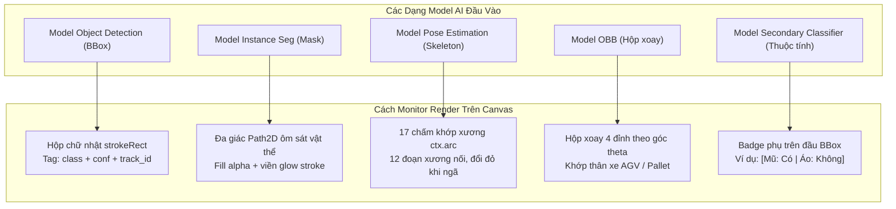
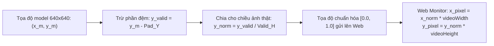
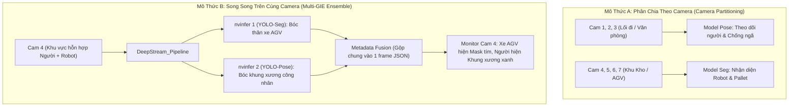

# BẢN ĐẶC TẢ KIẾN TRÚC & KẾ HOẠCH TRIỂN KHAI HỆ THỐNG AI ĐA MODEL (MULTI-MODEL), NATIVE SEGMENTATION & RULE ENGINE TRÊN DEEPSTREAM

- **Tài liệu:** Production Architecture & Agent Implementation Rules
- **Dự án:** Vision Behavior Manager (RSkyView)
- **Phiên bản:** 3.0 (Master Blueprint: Bao quát toàn bộ Model, Bộ Quy Tắc Chống Lệch Khung Hình & Hướng Dẫn Thực Thi Cho Agent)
- **Chế độ:** Document Only (Chỉ lập đặc tả, không tự ý can thiệp mã nguồn khi chưa có lệnh)

---

## MỤC LỤC
1. [TỔNG QUAN VÀ MỤC TIÊU HỆ THỐNG](#1-tổng-quan-và-mục-tiêu-hệ-thống)
2. [ĐẶC TẢ HIỂN THỊ CÁC LOẠI MÔ HÌNH AI TRÊN MONITOR](#2-đặc-tả-hiển-thị-các-loại-mô-hình-ai-trên-monitor)
3. [BỘ QUY TẮC TOÁN HỌC CHỐNG LỆCH KHUNG HÌNH (ANTI-MISALIGNMENT INVARIANTS)](#3-bộ-quy-tắc-toán-học-chống-lệch-khung-hình-anti-misalignment-invariants)
4. [BỘ QUY TẮC PHÂN TÍCH HÀNH VI (BEHAVIOR RULE ENGINE SPECIFICATIONS)](#4-bộ-quy-tắc-phân-tích-hành-vi-behavior-rule-engine-specifications)
5. [KIẾN TRÚC ĐA MODEL ĐỒNG THỜI (MULTI-MODEL SIMULTANEOUS ARCHITECTURE)](#5-kiến-trúc-đa-model-đồng-thời-multi-model-simultaneous-architecture)
6. [BỘ NGUYÊN TẮC BẮT BUỘC CHO AGENT KHI THỰC THI (AGENT IMPLEMENTATION RULES)](#6-bộ-nguyên-tắc-bắt-buộc-cho-agent-khi-thực-thi-agent-implementation-rules)
7. [LỘ TRÌNH TRIỂN KHAI CHI TIẾT TỪNG BƯỚC (STEP-BY-STEP ROADMAP)](#7-lộ-trình-triển-khai-chi-tiết-từng-bước-step-by-step-roadmap)

---

## 1. TỔNG QUAN VÀ MỤC TIÊU HỆ THỐNG

### 1.1. Hiện trạng cần xóa bỏ hoàn toàn
1. **Khóa cứng (Hardcoded Blockers):** Xóa bỏ `DISABLE_CUSTOM_DETECTOR=1` và `DISABLE_DEEPSTREAM_MODEL=1` trong `backend/main.py`.
2. **Khóa Singleton:** Xóa bỏ cơ chế `vision.monitor_model` singleton chỉ cho phép 1 model chạy tại một thời điểm.
3. **Nút thắt SAM2:** Loại bỏ hoàn toàn worker SAM2 Python (độ trễ 400ms - 1000ms/frame), thay bằng **YOLO-Seg Native C++**.

### 1.2. Mục tiêu kỹ thuật
- **Tốc độ:** Xử lý Realtime **25 - 30 FPS** đồng thời trên 7 camera với độ trễ suy luận $\le 5\text{ms/frame}$.
- **Đa Model:** Cho phép deploy cùng lúc nhiều model (Detect, Seg, Pose, OBB, Classifier) phân chia theo từng camera hoặc chạy song song trên cùng một camera.
- **Hiển thị Pixel-Perfect:** Khung vẽ BBox, Skeleton, Mask trên Web Canvas phải khớp chính xác 100% với video WebRTC, không lệch 1 pixel nào dù màn hình co dãn cỡ nào.

---

## 2. ĐẶC TẢ HIỂN THỊ CÁC LOẠI MÔ HÌNH AI TRÊN MONITOR

Mỗi loại mô hình AI khi đưa lên Web Monitor phải được trực quan hóa theo đúng định dạng chuyên biệt:



### Chi tiết Payload Metadata & Phong Cách Hiển Thị:

| Loại Model | Cấu Trúc JSON Backend Xuất Ra | Cách Vẽ Trên Web Canvas | Trạng Thái Cảnh Báo |
| :--- | :--- | :--- | :--- |
| **YOLO-Detect** | `bbox: [x, y, w, h]`, `class: "forklift"`, `conf: 0.95`, `track_id: 101` | Hộp chữ nhật bo góc viền 1.5px. Thẻ tag nhãn: `forklift #101 (95%)`. Vẽ vệt đuôi di chuyển mờ dần (Trajectory tail). | Viền đổi sang **đỏ rực nhấp nháy** khi vi phạm vùng cấm (ROI Intrusion). |
| **YOLO-Seg** | `mask: { polygons: [[[x1, y1], [x2, y2], ...]] }`, `class: "agv"`, `track_id: 12` | Canvas `Path2D`: `ctx.fill()` màu bán trong suốt ($\alpha = 0.25$) theo bảng màu class. `ctx.stroke()` viền ngoài sắc nét phát sáng 1.5px. | Đo diện tích chiếm dụng ô kệ (Occupancy %). |
| **YOLO-Pose** | `keypoints: [[x, y, conf], ... 17 điểm]`, `posture: "standing" \| "fallen"` | **17 chấm tròn** (bán kính 3px) tại các khớp COCO. **12 đoạn xương nối** đôi vai, hông, tay, chân. Màu xanh ngọc (`#4ade80`). | Khi góc trục thân nằm ngang sàn $> 1.5$s: Khung xương chuyển sang **đỏ rực (`#ef4444`)**, hiện chữ `⚠️ PHÁT HIỆN TÉ NGÃ`. |
| **YOLO-OBB** | `obb: { points: [[x1, y1], [x2, y2], [x3, y3], [x4, y4]], angle: -24.5 }` | Dùng `ctx.beginPath()` nối 4 đỉnh xoay theo chiều xe thực tế. Vẽ mũi tên chỉ hướng tiến/lùi của xe AGV. | Cảnh báo khi góc xoay của xe đi chệch khỏi luồng đường di chuyển quy định. |
| **Secondary Classifier** | `attributes: { helmet: true, vest: false, battery_level: "charging" }` | Vẽ các huy hiệu (Badge) hình viên thuốc nhỏ gắn ngay trên đầu BBox: `[Mũ: OK]`, `[Áo: THIẾU]`. | Badge thiếu bảo hộ nhấp nháy cảnh báo an toàn lao động PPE. |

---

## 3. BỘ QUY TẮC TOÁN HỌC CHỐNG LỆCH KHUNG HÌNH (ANTI-MISALIGNMENT INVARIANTS)

> [!IMPORTANT]
> **Quy Tắc Vàng (Invariant #1): TẤT CẢ TỌA ĐỘ BẮT BUỘC PHẢI Ở DẢI CHUẨN HÓA $[0.0, 1.0]$.**
> Tuyệt đối không được gửi tọa độ pixel cứng (ví dụ: `640`, `1280`, `720`) qua WebSocket. Mọi điểm $x, y$ bắn về Web phải thuộc khoảng $[0.0, 1.0]$ tương ứng với toàn bộ khung nhìn gốc của camera đó.

### 3.1. Bản chất hiện tượng lệch hình
- Video camera là tỉ lệ **16:9** ($1280 \times 720$).
- Model AI nhận input vuông **1:1** ($640 \times 640$).
- Khi DeepStream `nvinfer` chạy chế độ `maintain-aspect-ratio=1`, ảnh 16:9 được resize và chèn đệm 2 dải đen (Letterbox Padding) ở trên và dưới:
  $$\text{Scale} = \frac{640}{1280} = 0.5$$
  $$\text{Chiều cao ảnh thật trong model: } \text{Valid}_H = 720 \times 0.5 = 360\text{px}$$
  $$\text{Khoảng đệm trên/dưới: } \text{Pad}_Y = \frac{640 - 360}{2} = 140\text{px}$$

### 3.2. Thuật toán Un-Letterbox chuẩn hóa bắt buộc
Trước khi đóng gói JSON gửi qua WebSocket, probe DeepStream **phải áp dụng công thức sau** để giải phóng padding cho từng loại dữ liệu:



#### Công thức Un-Letterbox tổng quát:
Cho một camera có độ phân giải luồng $W_{\text{stream}}, H_{\text{stream}}$ và kích thước input model $W_{\text{net}}, H_{\text{net}}$:
$$r = \min\left(\frac{W_{\text{net}}}{W_{\text{stream}}}, \frac{H_{\text{net}}}{H_{\text{stream}}}\right)$$
$$\text{Valid}_W = W_{\text{stream}} \times r, \qquad \text{Valid}_H = H_{\text{stream}} \times r$$
$$\text{Pad}_X = \frac{W_{\text{net}} - \text{Valid}_W}{2}, \qquad \text{Pad}_Y = \frac{H_{\text{net}} - \text{Valid}_H}{2}$$

#### 1. Áp dụng cho Bounding Box:
$$x_{\text{norm}} = \frac{x_{\text{box}} - \text{Pad}_X}{\text{Valid}_W}, \quad y_{\text{norm}} = \frac{y_{\text{box}} - \text{Pad}_Y}{\text{Valid}_H}, \quad w_{\text{norm}} = \frac{w_{\text{box}}}{\text{Valid}_W}, \quad h_{\text{norm}} = \frac{h_{\text{box}}}{\text{Valid}_H}$$

#### 2. Áp dụng cho 17 Điểm Khung Xương (Pose Keypoints):
Với mỗi điểm thứ $i \in [0, 16]$ có tọa độ $(x_i, y_i, \text{conf}_i)$:
$$x_{i,\text{norm}} = \frac{x_i - \text{Pad}_X}{\text{Valid}_W}, \qquad y_{i,\text{norm}} = \frac{y_i - \text{Pad}_Y}{\text{Valid}_H}$$

#### 3. Áp dụng cho Đa Giác Mask Seg (Polygon Contours):
Với mỗi đỉnh $(x_k, y_k)$ trên đường biên mask:
$$x_{k,\text{norm}} = \frac{x_k - \text{Pad}_X}{\text{Valid}_W}, \qquad y_{k,\text{norm}} = \frac{y_k - \text{Pad}_Y}{\text{Valid}_H}$$

---

## 4. BỘ QUY TẮC PHÂN TÍCH HÀNH VI (BEHAVIOR RULE ENGINE SPECIFICATIONS)

Hệ thống cung cấp **6 bộ quy tắc hành vi đúc sẵn** (Production-ready Rules). Mỗi rule được quản lý trong bảng PostgreSQL `rules` và phải có trường `model_id` để tránh nhầm lẫn class:

### 4.1. Quy tắc 1: Xâm Nhập Vùng Cấm (`ROI_INTRUSION`)
- **Mục đích:** Báo động khi công nhân bước vào đường xe chạy, hoặc xe AGV đi lạc vào khu vực cấm.
- **Điều kiện kích hoạt:** Điểm chân tiếp đất (`floor_pos` hoặc tâm đáy của BBox $[x + \frac{w}{2}, y + h]$) nằm bên trong đa giác vùng cấm $P_{\text{ROI}}$ theo thuật toán Ray-Casting Point-in-Polygon.
- **Cấu hình JSON:**
  ```json
  {
    "rule_type": "intrusion",
    "model_id": "yolo11_person_detector",
    "target_objects": ["person"],
    "points": [[0.15, 0.40], [0.45, 0.40], [0.45, 0.85], [0.15, 0.85]],
    "severity": "critical",
    "cooldown_sec": 3.0
  }
  ```

### 4.2. Quy tắc 2: Cắt Vạch Ảo / Hàng Rào Ảo (`TRIPWIRE`)
- **Mục đích:** Đếm lưu lượng người/xe ra vào cửa xưởng, cảnh báo đi ngược chiều.
- **Điều kiện kích hoạt:** Đoạn thẳng nối vị trí đối tượng giữa frame $t-1$ và frame $t$ cắt ngang đoạn thẳng vạch ảo $AB$.
- **Cấu hình JSON:**
  ```json
  {
    "rule_type": "tripwire",
    "model_id": "yolo11_logistics_detector",
    "target_objects": ["agv_robot", "forklift"],
    "points": [[0.2, 0.7], [0.8, 0.7]],
    "direction": "in",
    "cooldown_sec": 1.0
  }
  ```

### 4.3. Quy tắc 3: Dừng Đỗ / Tụ Tập Quá Lâu (`DWELL_TIME`)
- **Mục đích:** Phát hiện xe AGV bị kẹt chết máy hoặc công nhân đứng tụ tập quá thời gian cho phép.
- **Điều kiện kích hoạt:** Đối tượng có cùng `track_id` duy trì vị trí trong vùng ROI liên tục vượt quá ngưỡng thời gian $T$.
- **Cấu hình JSON:**
  ```json
  {
    "rule_type": "dwell_time",
    "target_objects": ["agv_robot"],
    "points": [[0.3, 0.3], [0.7, 0.3], [0.7, 0.7], [0.3, 0.7]],
    "threshold": 30.0,
    "severity": "warning"
  }
  ```

### 4.4. Quy tắc 4: Quá Tải Mật Độ (`CROWD_DENSITY`)
- **Mục đích:** Kiểm soát mật độ người trong khu vực hẹp để đảm bảo an toàn lao động.
- **Điều kiện kích hoạt:** Tổng số đối tượng hợp lệ cùng lúc nằm trong vùng ROI vượt quá số lượng $N$.
- **Cấu hình JSON:**
  ```json
  {
    "rule_type": "crowd_density",
    "target_objects": ["person"],
    "points": [[0.1, 0.1], [0.9, 0.1], [0.9, 0.9], [0.1, 0.9]],
    "threshold": 6,
    "severity": "warning"
  }
  ```

### 4.5. Quy tắc 5: Phát Hiện Té Ngã Khẩn Cấp (`FALL_DETECTION`)
- **Mục đích:** Phát hiện công nhân bị ngã, trượt chân hoặc ngất xỉu.
- **Điều kiện kích hoạt:** Dựa trên Model Pose: Góc nghiêng giữa trục cột sống (nối tâm vai và tâm hông) so với mặt phẳng sàn $< 30^\circ$, hoặc tỷ lệ $\frac{\text{Width}}{\text{Height}} > 1.3$, duy trì liên tục $> 1.5$ giây.
- **Cấu hình JSON:**
  ```json
  {
    "rule_type": "fall_detection",
    "model_id": "yolo11_pose_engine",
    "target_objects": ["person"],
    "threshold": 1.5,
    "severity": "emergency"
  }
  ```

### 4.6. Quy tắc 6: Trạng Thái Ô Chứa Kệ Hàng (`SLOT_OCCUPANCY`)
- **Mục đích:** Tự động phát hiện ô kệ đang Trống (`EMPTY`) hay Đã Có Hàng (`OCCUPIED`).
- **Điều kiện kích hoạt:** Dựa trên Model Seg: Tính tỷ lệ diện tích giao nhau (Intersection Over Union - IoU hoặc Overlap Area) giữa Polygon Mask của kiện hàng/pallet với Polygon ô chứa kệ:
  $$\text{Overlap Ratio} = \frac{\text{Area}(\text{Mask}_{\text{pallet}} \cap \text{ROI}_{\text{slot}})}{\text{Area}(\text{ROI}_{\text{slot}})}$$
  Nếu $\text{Overlap Ratio} > 0.3$ (30%), đánh dấu ô kệ là `OCCUPIED`. Ngược lại là `EMPTY`.
- **Cấu hình JSON:**
  ```json
  {
    "rule_type": "occupancy",
    "model_id": "yolo11_pallet_seg",
    "target_objects": ["pallet", "box"],
    "points": [[0.50, 0.60], [0.65, 0.60], [0.65, 0.75], [0.50, 0.75]],
    "threshold": 0.3
  }
  ```

---

## 5. KIẾN TRÚC ĐA MODEL ĐỒNG THỜI (MULTI-MODEL SIMULTANEOUS ARCHITECTURE)

### 5.1. Hai Mô Thức Hoạt Động (Deployment Modes)



### 5.2. Quản lý tài nguyên GPU Budget (RTX 4060 Ti 16GB)
- Mỗi model TensorRT FP16 tiêu tốn: $\sim 300\text{MB} - 600\text{MB}$ VRAM.
- Chạy 3 model cùng lúc cho 7 camera: Tổng VRAM chiếm dụng khoảng $\sim 2.5\text{GB} - 3.5\text{GB}$ (hoàn toàn an toàn trên card 16GB).
- GPU Compute utilization duy trì ở mức $45\% - 65\%$, đảm bảo nhiệt độ card mát và giữ vững 30 FPS.

---

## 6. BỘ NGUYÊN TẮC BẮT BUỘC CHO AGENT KHI THỰC THI (AGENT IMPLEMENTATION RULES)

Khi lập trình viên hoặc AI Agent bắt tay vào sửa mã nguồn, **bắt buộc phải tuân thủ nghiêm ngặt 6 nguyên tắc bất biến (Invariants) sau:**

> [!CAUTION]
> ### 🛑 NGUYÊN TẮC 1: KHÔNG SỬ DỤNG SAM2 CHO LUỒNG MONITOR
> Tuyệt đối không được import hay khởi chạy bất kỳ module SAM2 PyTorch nào trong worker realtime. Tất cả chức năng sinh Mask phải do TensorRT `nvinfer` (YOLO-Seg) đảm nhiệm trong thời gian $\le 5\text{ms}$.
>
> ### 🛑 NGUYÊN TẮC 2: KHÔNG MÃ HÓA LẠI VIDEO TRÊN SERVER (ZERO NVENC)
> Không được thêm các phần tử `nvv4l2h264enc` để nén video gửi về web. Video WebRTC phải luôn chạy passthrough từ MediaMTX; AI chỉ được xuất Metadata JSON qua WebSocket.
>
> ### 🛑 NGUYÊN TẮC 3: MỌI TỌA ĐỘ PHẢI ĐƯỢC UN-LETTERBOX
> Không được gửi tọa độ nguyên bản từ model 640x640 lên Web. Mọi tọa độ BBox, 17 Keypoints, và Polygon Mask phải được trừ bỏ `Pad_Y` và chia cho kích thước vùng hợp lệ để chuẩn hóa về $[0.0, 1.0]$.
>
> ### 🛑 NGUYÊN TẮC 4: KHÔNG DÙNG RÀNG BUỘC SINGLETON
> Database không được dùng ràng buộc `CHECK(singleton)` cho bảng deployment. Cấu trúc bảng phải hỗ trợ gán linh hoạt nhiều `model_id` cho các tập `camera_ids` khác nhau.
>
> ### 🛑 NGUYÊN TẮC 5: TƯƠNG THÍCH NGƯỢC METADATA (BACKWARD COMPATIBILITY)
> Cấu trúc JSON gửi qua WebSocket phải luôn giữ các trường cơ bản (`cam_id`, `frame_id`, `timestamp`, `objects`). Trong mỗi object có các trường tùy chọn theo model:
> - Nếu là Detect: Có `bbox`, `class`, `confidence`, `track_id`.
> - Nếu là Seg: Có thêm trường `mask: { polygons: [...] }`.
> - Nếu là Pose: Có thêm trường `keypoints: [[x, y, conf], ...]`.
>
> ### 🛑 NGUYÊN TẮC 6: XỬ LÝ LỖI KHÔNG ĐƯỢC LÀM CRASH PIPELINE
> Nếu một model bị lỗi hoặc một camera tạm thời mất tín hiệu RTSP, pipeline của các camera và model khác phải tiếp tục chạy bình thường, không được để lỗi lan ra toàn hệ thống.

---

## 7. LỘ TRÌNH TRIỂN KHAI CHI TIẾT TỪNG BƯỚC (STEP-BY-STEP ROADMAP)

Khi người dùng ra lệnh triển khai, Agent sẽ thực hiện tuần tự theo 5 giai đoạn:

### Giai Đoạn 1: Cấu Trúc Dữ Liệu & API Quản Trị Đa Model
1. Chạy migration PostgreSQL: Xóa bảng `vision.monitor_model`, tạo bảng `vision.model_deployments`.
2. Nâng cấp [backend/core/model_registry.py](file:///home/rtcai/Desktop/Vision%20Manager/backend/core/model_registry.py): Hỗ trợ thêm/xóa/sửa danh sách deployment đa model.
3. Cập nhật Router [backend/routers/models.py](file:///home/rtcai/Desktop/Vision%20Manager/backend/routers/models.py): Thêm các endpoint `/api/models/deployments` hỗ trợ bật/tắt từng model.

### Giai Đoạn 2: Xây Dựng Thư Viện C++ Parser YOLO-Seg
1. Tải source code `DeepStream-Yolo-Seg` (từ marcoslucianops).
2. Biên dịch thư viện C++ `libnvdsinfer_custom_impl_Yolo_seg.so` với CUDA 12.8.
3. Đặt file thư viện vào container tại `/opt/visionmanager/libnvdsinfer_custom_impl_Yolo_seg.so`.
4. Tạo hàm tự động sinh `nvinfer.txt` với `network-type=3` và `parse-bbox-func-name=NvDsInferParseYoloSeg`.

### Giai Đoạn 3: Cải Tổ Backend DeepStream Worker & Tích Hợp Un-Letterbox
1. Mở file [backend/main.py](file:///home/rtcai/Desktop/Vision%20Manager/backend/main.py): Xóa bỏ dòng gán `DISABLE_CUSTOM_DETECTOR` và `DISABLE_DEEPSTREAM_MODEL`.
2. Viết hàm toán học `unletterbox_point()` và `unletterbox_polygon()` trong file probe.
3. Bỏ hoàn toàn import `ModelSAM2` trong `custom_deepstream_worker.py`. Đọc thẳng `NvDsMaskParams` từ C++, convert contour sang polygon, un-letterbox và đóng gói JSON.
4. Nâng cấp Metadata Fusion để gộp dữ liệu từ nhiều model trước khi broadcast.

### Giai Đoạn 4: Hoàn Thiện Rule Engine
1. Cập nhật [backend/core/behavior_analytics.py](file:///home/rtcai/Desktop/Vision%20Manager/backend/core/behavior_analytics.py): Khớp điều kiện rule theo `model_id` và `target_objects`.
2. Tích hợp thuật toán tính diện tích đè Polygon Mask cho quy tắc `SLOT_OCCUPANCY`.
3. Tích hợp thuật toán góc cột sống cho quy tắc `FALL_DETECTION`.

### Giai Đoạn 5: Nâng Cấp Giao Diện Web Dashboard
1. Cập nhật [ModelManager.tsx](file:///home/rtcai/Desktop/Vision%20Manager/web-dashboard/components/views/ModelManager.tsx): Giao diện Checkbox chọn nhiều model, bảng danh sách Active Deployments.
2. Cập nhật [MonitorView.tsx](file:///home/rtcai/Desktop/Vision%20Manager/web-dashboard/components/views/MonitorView.tsx): 
   - Render BBox (Detect), Mask đa giác (Seg), Khung xương 17 điểm (Pose).
   - Render viền đỏ cảnh báo khi vi phạm Rule.
3. Build lại container Docker frontend và backend. Kiểm thử toàn diện.

---

## 8. TIÊU CHÍ NGHIỆM THU HỆ THỐNG (ACCEPTANCE CRITERIA)

| Hạng Mục | Tiêu Chí Đạt Chuẩn |
| :--- | :--- |
| **Độ chính xác vị trí** | BBox, Khung xương 17 điểm và Mask ôm khít vật thể, sai số lệch tọa độ $\le 2\text{ pixel}$ trên mọi tỉ lệ màn hình. |
| **Hiệu năng Realtime** | Tốc độ khung hình trên 7 camera đạt $\ge 25\text{ FPS}$. Độ trễ xử lý AI $\le 10\text{ms/frame}$. |
| **Tính năng Đa Model** | Bật đồng thời 2-3 model: Web Monitor hiển thị đầy đủ cả BBox, Mask và Khung xương của các đối tượng tương ứng. |
| **Độ nhạy Rule Engine** | Khi có vi phạm quy tắc (xâm nhập, ngã, kẹt xe): Monitor đổi màu cảnh báo trong vòng $< 100\text{ms}$. |
| **Độ ổn định** | Chạy liên tục không bị tràn VRAM, không bị watchdog timeout ngắt kết nối video. |
